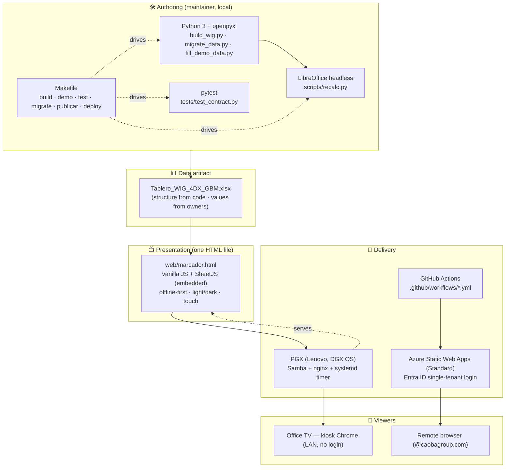
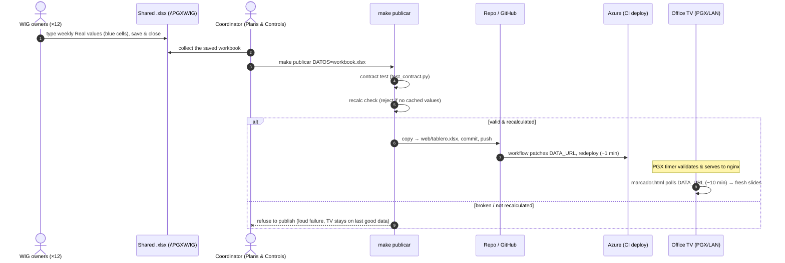
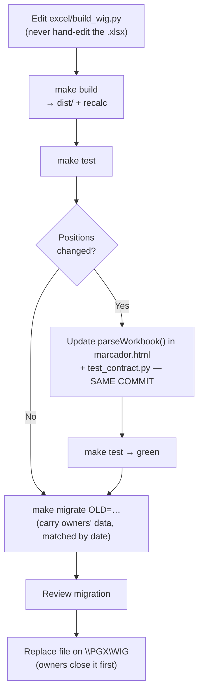

# Design Doc — Marcador WIG 4DX (GBM Nicaragua)

> **Status:** As-built design (documents the system that exists today) + the rationale
> behind it. **Owner:** Plans & Controls (Danilo Chamorro). **Audience:** software
> maintainers and anyone extending the system.
>
> **How this relates to the other docs.** The [`PRD`](./PRD.md) covers the *product* —
> problem, users, experience, success metrics. [`CLAUDE.md`](../CLAUDE.md) is the
> *authoritative reference* for the Excel↔parser contract (fixed cells, exact strings).
> **This document is the bridge:** *why* the system is shaped the way it is — architecture,
> components, data flow, key decisions, trade-offs, and failure modes. When this doc and
> `CLAUDE.md`/`tests/test_contract.py` disagree on a concrete cell or position, **they win**
> and this doc should be corrected.
>
> **Language note:** the codebase, the workbook, and the TV scoreboard are in Spanish (the
> users' language). This doc is in English; product/UI strings stay in their original Spanish.

---

## 1. Purpose & scope

Provide GBM Nicaragua's 4DX execution system with **Discipline 3 — a compelling scoreboard**
that is current, glanceable on an office TV, and effortless for twelve functional owners
to keep updated. The company WIG is **$1,000,000 of net profit after taxes (NAT) in 2027**
($2M in 2028), decomposed into **12 supporting WIGs** with weekly/monthly lead measures.

This doc covers the technical design of:
- the workbook structure generator and its contract with the TV parser,
- the self-contained TV scoreboard,
- the publishing pipeline and dual deployment topology (LAN via PGX + remote via Azure).

It does **not** cover product requirements (see PRD) nor the Monday meeting ritual (lives in
claude.ai, not this repo).

## 2. Design principles

These are the load-bearing constraints; every component decision traces back to one of them.

1. **Owners edit in the tool they already trust (Excel).** Adoption cost must be ≈ 0 — no new
   tool, no login, no training beyond "type in the blue cells." This is *the* constraint that
   forces Excel as the data source and rules out BI/Airtable/Sheets for now.
2. **The scoreboard is readable in 5 seconds from across a room.** A spreadsheet grid is not.
   So the TV is a separate, purpose-built visual layer, not Excel rendered on a screen.
3. **Structure is code; data is cells.** The workbook *shape* is generated by one Python
   script and never hand-edited. The *values* are owner-editable input cells. This keeps the
   contract enforceable and the structure reproducible.
4. **Offline-first, low-maintenance.** The TV must survive a flaky network and never go blank,
   and the system must need ≈ 0 engineering attention week to week.
5. **Fail loud at publish, never on the TV.** A broken or unrecalculated workbook is rejected
   at publish time (CI/`make publicar`), so the screen in the office is never the place a bug
   first shows up.

## 3. System overview

```
excel/build_wig.py  ──generates──▶  dist/Tablero_WIG_4DX_GBM.xlsx   (structure only)
                                          │
                                          │ owners type weekly/monthly numbers into the
                                          │ shared copy on \\PGX\WIG (blue input cells)
                                          ▼
                        scripts/recalc.py  (LibreOffice headless — MANDATORY:
                        openpyxl doesn't compute; SheetJS reads only cached values)
                                          │
                  ┌───────────────────────┴───────────────────────┐
                  │                                                │
            LAN path (office TV)                            Remote path (authenticated)
            PGX (Lenovo, DGX OS):                           Azure Static Web Apps:
            Samba shares the .xlsx,                          make publicar → contract test
            timer validates & publishes                      + recalc check → web/tablero.xlsx
            to nginx                                          → push → Azure redeploy (~1 min)
                  │                                                │
                  ▼                                                ▼
          web/marcador.html fetches DATA_URL              web/marcador.html (DATA_URL patched
          every ~10 min; kiosk Chrome on the TV           to 'tablero.xlsx' at deploy); company
          rotates slides                                  login via Entra ID (one tenant)
```

Two delivery paths, **one HTML artifact**. The office TV reads from the PGX over the LAN with
no login (same trust boundary as the building). Azure is the authenticated copy for remote
access — company login only (`@caobagroup.com`).

### 3.1 Tech stack (sketch)



## 4. Components

| Component | File | Responsibility |
|---|---|---|
| **Workbook generator** | `excel/build_wig.py` | Single source of truth for structure: Dashboard, 12 WIG tabs, 3 year pages, Instrucciones. Defines the `WIGS` list and all lead measures. |
| **Data migrator** | `excel/migrate_data.py` | Copies owners' typed data from an old workbook into a freshly built one, matching rows **by date** so period-range changes don't misalign. |
| **Demo filler** | `excel/fill_demo_data.py` | Dummy data for demos. |
| **Recalculator** | `scripts/recalc.py` | LibreOffice headless recompute → caches calculated values. Mandatory after build/migrate/fill. |
| **Demo embedder** | `scripts/build_demo.py` | Inlines an `.xlsx` into the HTML for a standalone demo. |
| **TV scoreboard** | `web/marcador.html` | Self-contained (SheetJS embedded, offline-capable). `parseWorkbook()` reads fixed positions; renders rotating slides; light/dark theme; touch drill-down. |
| **Contract tests** | `tests/test_contract.py` | Enforces the Excel↔parser contract; fails CI on structural drift. |
| **PGX setup** | `deploy/setup-wig.sh` | Installs Samba + nginx + the publish timer on the PGX. |
| **Azure config** | `web/staticwebapp.config.json` | Standard tier; company login (single-tenant Entra ID). |
| **CI** | `.github/workflows/*.yml` | Publishes `marcador.html` + `web/tablero.xlsx` to Azure on push to `main` touching `web/`; patches `DATA_URL`. |

## 5. Data model & the contract

The single most important design decision: **`parseWorkbook()` reads fixed cell positions.**
There is no schema negotiation, no header-name lookup — the parser knows that DATA0 = row 11,
MAX_LEADS = 8, lead names live in row 8 columns I/K/M/…, and so on. The full table lives in
[`CLAUDE.md` → "EL CONTRATO Excel ↔ parser"](../CLAUDE.md).

**Why fixed positions instead of named ranges or a header parser?**
- The workbook is *generated* (FR1/principle 3), so positions are deterministic and stable.
- A position contract is trivially testable: `test_contract.py` asserts exact cells, so any
  structural change fails CI loudly instead of silently misreading on the TV.
- It keeps `marcador.html` dependency-free (no Excel object model, just SheetJS cell reads).

**The cost** (accepted): any structural change must touch three files **in the same commit** —
`build_wig.py`, `parseWorkbook()` in `marcador.html`, and `test_contract.py`. This is the
explicit price of a position contract and is documented as a hard rule.

### Sheet inventory (current)

- **Dashboard** (first sheet, the home page): NAT targets 2027→2029 (rows 6–9, parser reads
  year + Meta NAT col D + NAT real col F), backlog coverage (rows 14–16), current-year monthly
  NAT tracking (C19 + rows 22–33), and a 12-WIG support roll-up (rows 37–48).
- **12 WIG tabs** (`1. …` … `12. …`): per-WIG lag definition, owner/team, target (B5's number
  *format* decides $/%/number display), cumulative-vs-level flag (E10), up to 8 lead measures.
- **3 year pages** (`2027`/`2028`/`2029`): each headed by the year's NAT target; weekly backlog
  coverage table. The TV generates a slide per year (NAT meta + backlog coverage).
- **Tareas** (supporting tasks per lead): flat sheet `WIG | Lead | Tarea | Responsable |
  Estado` (cols A–E, headers row 1, data row 2+). Every row is a concrete task tied to one
  lead measure (WIG 1–12, Lead 1–8); Estado ∈ {Pendiente, En curso, Hecho} via dropdowns. The
  build generates it (with seed example rows for WIG 1); `parseTareas` reads it by position and
  the TV shows it as "Tareas de soporte" in each lead's detail drill-down.
- **Instrucciones** (ignored by the parser).
- **Compromisos** (legacy/optional): the build no longer generates it, but the parser keeps
  optional support so old workbooks that carry it still drill down to per-lead commitments
  (shown below "Tareas de soporte" only when the sheet has rows).

### Direction conventions (scoreboard math)
- **Cumulative vs. level WIGs.** Cumulative accumulate toward a total; level WIGs hold at/under/
  over a threshold each period. Driven by E10 (text ⇒ cumulative; empty ⇒ level).
- **"Less is better" WIGs.** Detected by the `LOWER_BETTER` regex (`/expired|apalanca|costos?
  local/i`). When adding a level WIG where less = better, **extend that regex**. Lead measures
  are always phrased positively (more = better) so percentages stay comparable across WIGs.
- **Status semaphore.** En meta ≥95% · Riesgo 80–95% · Atrasado <80% — exact Spanish strings,
  because conditional formatting and the dashboard `SEARCH` on them.

## 6. Slide rendering design

The TV cycles slides in a fixed order: **Company (Dashboard NAT) → 2027 → 2028 → 2029 → the 12
WIGs**. Each WIG slide shows the lag gauge plus its lead measures.

**Lead visualizations are deterministic by position** (not data-driven), so the layout is
predictable and "the gauge is always L1":
- **L1 = gauge, L2 = sparkline** (these two are the "main bet," visually emphasized).
- **L3–L8 cycle** bar / bullet / big-number.
- Same color semaphore everywhere (En meta / Riesgo / Atrasado).

Other TV behaviors: auto-resume rotation after inactivity; swipe/click navigation (touch-
friendly); light/dark theme via the ◐ button or `T` key (persisted in localStorage); tapping a
lead opens its detail — indicator history, **supporting tasks** (the `Tareas` sheet, with a
Pendiente/En curso/Hecho status badge), and legacy commitments if a `Compromisos` sheet exists.

## 7. Data flow & the publishing pipeline

### 7.1 Weekly cadence (sketch)

The happy path that runs every Monday — owners type, the coordinator publishes, both screens
refresh.



### 7.2 Structural change (sketch)

The contract-safe path for changing the *shape* of the workbook (WIGs, leads, columns,
formulas). The three-files-in-one-commit rule (§5) is the gate before migrate/deploy.



### 7.3 Step-by-step

1. **Build.** `make build` runs `build_wig.py` → `dist/Tablero_WIG_4DX_GBM.xlsx`, then recalc.
2. **Owners enter data** in the shared copy on `\\PGX\WIG` (save-and-close; no co-editing).
3. **Publish (Monday, one person):** `make publicar DATOS=…` →
   - run `tests/test_contract.py` (contract green), and
   - **check recalc state** — a workbook with no cached calculated values is rejected (it would
     render blank on the TV).
   - on success: copy to `web/tablero.xlsx`, commit, push.
4. **Deploy fan-out:**
   - **Azure:** the push triggers the workflow, which patches `DATA_URL: 'tablero.xlsx'` and
     redeploys (~1 min). Remote viewers authenticate via company login.
   - **PGX/LAN:** the timer validates and publishes the shared `.xlsx` to nginx; the office TV's
     `marcador.html` polls `DATA_URL` every ~10 min.
5. **Structural change (ad hoc):** edit `build_wig.py` → `make build` → `make test`; if positions
   changed, update `parseWorkbook` + `test_contract.py` **in the same commit** → `make migrate
   OLD=…` to carry owners' data forward (rows matched by date) → review → replace on `\\PGX\WIG`.

**Why recalc is mandatory and enforced at publish:** openpyxl writes formulas but does not
compute them, and SheetJS in the browser reads only *cached* values. So a freshly built/migrated
workbook has empty calculated cells until LibreOffice headless recomputes. Making `make publicar`
refuse an unrecalculated file turns "blank TV" from a silent production incident into a loud
publish-time failure (principle 5).

## 8. Deployment topology & security

- **LAN (office TV):** PGX (repurposed Lenovo, DGX OS) runs Samba (shares the workbook for
  owners) + nginx (serves `marcador.html` + the validated `.xlsx`) + a publish timer. The TV runs
  kiosk Chrome against the PGX over the LAN — **no login**, because the LAN is the trust boundary.
- **Remote (Azure Static Web Apps):** the same HTML, with `DATA_URL` patched to `tablero.xlsx`,
  behind **company login** (single-tenant Entra ID, `@caobagroup.com` only) — requires the
  Standard tier. First-time portal setup: [`docs/AZURE_LOGIN.md`](./AZURE_LOGIN.md) and
  [`docs/PUESTA-EN-MARCHA-AZURE.md`](./PUESTA-EN-MARCHA-AZURE.md).

The scoreboard exposes internal targets and performance, so it is never public: LAN-only on the
PGX, login-gated on Azure.

## 9. Alternatives considered (and why not)

| Decision | Alternatives rejected | Why the current choice |
|---|---|---|
| **Excel as data source** | Airtable / Google Sheets / Power BI / small DB | Zero adoption cost for owners (principle 1). The others impose a new tool + login + ongoing ops. Deliberately a *starting* point until the cadence matures. **Airtable is now prototyped as "Option A"** (`excel/build_airtable.py`, [`docs/AIRTABLE.md`](./AIRTABLE.md)) — capture in Airtable, Excel stays the calc engine, contract untouched; also feeds per-person TRMNL e-ink cards (`web/trmnl_card_*.svg`). Exploratory, not the live source yet. |
| **Fixed-position contract** | Named ranges / header-name parsing | Workbook is generated → positions are stable; positions are trivially unit-testable so drift fails CI, not the TV. |
| **Self-contained HTML + SheetJS** | A served web app / framework / build step | Offline-first, no server dependency on the TV, no build toolchain; one file to deploy and dogfood. |
| **Save-and-close on Samba** | Live co-editing (SharePoint) | Simplest thing that works for a handful of weekly editors; SharePoint is the documented escape hatch if it becomes painful. |
| **Two delivery paths (PGX + Azure)** | Azure only / PGX only | PGX gives a login-free, resilient office TV on the LAN; Azure gives authenticated remote access. Same HTML serves both. |
| **Recalc gate at publish** | Trust the editor to recalc / recalc in browser | openpyxl doesn't compute and SheetJS reads cached values only; enforcing recalc at publish prevents a blank TV. |

## 10. Failure modes & resilience

| Failure | Effect if unhandled | Design mitigation |
|---|---|---|
| Forgotten recalc | Blank TV | `make publicar` / CI reject an unrecalculated workbook (§7). |
| Structural drift (cells move) | TV misreads | Position contract + `test_contract.py` fail CI before deploy. |
| Network blip on the TV | Screen could blank | Offline-first HTML, same-origin fetch; last good data stays on screen. |
| Shared file corrupts/locks | Whole scoreboard down | Workbook is generated from code (rebuild anytime); `migrate_data.py` recovers owners' data by date. |
| Owners stop entering data | Stale scoreboard, cadence dies | Zero-friction Excel entry; fallback = single coordinator types all numbers. |
| Public exposure of targets | Confidentiality breach | LAN-only on PGX; company login on Azure. |

## 11. Extending the system

- **Add/remove a WIG, lead, column, or formula:** edit `build_wig.py` only → `make build` →
  `make test`; if positions changed, update `parseWorkbook` + `test_contract.py` in the same
  commit → `make migrate OLD=…` → review → replace on `\\PGX\WIG`. Never hand-edit the `.xlsx`
  for structure.
- **Add a level WIG where less is better:** extend the `LOWER_BETTER` regex (§5).
- **Change a target/lead name/owner:** that's a data edit — owners do it directly in the shared
  copy; no code change.

## 12. Out of scope / future (don't re-litigate without reason)

SharePoint / co-editing; moving off Excel as the data source (Airtable "Option A" + TRMNL desktop
cards are prototyped — see §9 and [`docs/AIRTABLE.md`](./AIRTABLE.md) — but not the live source);
weekly history & trend persistence; alerting when a WIG flips to *Atrasado* or an owner hasn't
updated; multi-country rollout. See [`PRD` §9](./PRD.md) for the trade-offs already weighed.

## 13. References

- [`CLAUDE.md`](../CLAUDE.md) — authoritative architecture + the Excel↔parser contract + workflow.
- [`docs/PRD.md`](./PRD.md) — product: problem, users, experience, success metrics.
- [`excel/build_wig.py`](../excel/build_wig.py) — single source of truth for structure & the 12 WIGs.
- [`tests/test_contract.py`](../tests/test_contract.py) — enforces the contract.
- [`README.md`](../README.md) — quick start, production, Azure Monday ritual.
- [`docs/AZURE_LOGIN.md`](./AZURE_LOGIN.md), [`docs/PUESTA-EN-MARCHA-AZURE.md`](./PUESTA-EN-MARCHA-AZURE.md) — Azure setup.
- [`docs/AIRTABLE.md`](./AIRTABLE.md), [`excel/build_airtable.py`](../excel/build_airtable.py) — Airtable "Option A" + TRMNL desktop cards (exploratory).
</content>
</invoke>
